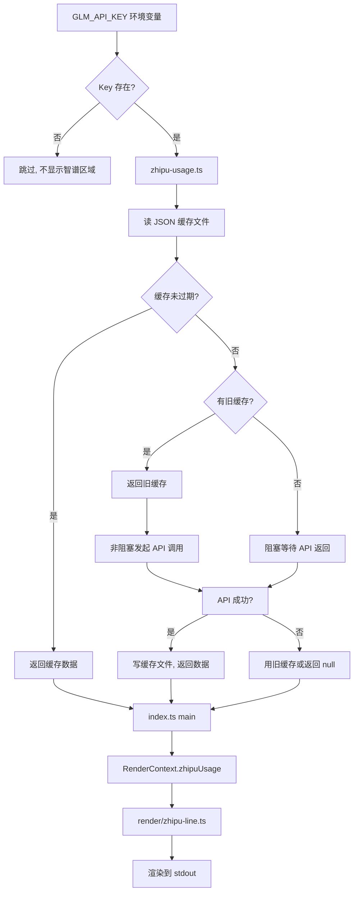

# 智谱 Coding Plan 用量显示设计

## 背景

claude-hud 目前的 usage 行只支持 Anthropic 官方订阅的 5h/7d 用量数据，通过 Claude Code stdin 传入。使用第三方模型（如智谱）时，这些字段为空，usage 行无法显示任何内容。

智谱 Coding Plan 有独立的配额体系（5h token、周 token、MCP 调用次数、订阅状态），需要通过 `https://api.z.ai` 的 API 获取。

## 目标

在 claude-hud 中新增一个独立的智谱用量显示区域，展示：
- 5 小时 token 用量百分比 + 重置时间
- 周额度百分比 + 重置时间
- MCP 工具调用次数/总量 + 百分比 + 重置时间
- 当前订阅计划 + 续费时间
- 数据刷新时间

## 架构决策

| 决策点 | 选择 | 理由 |
|--------|------|------|
| 实现方式 | 内置到 claude-hud | 无需额外后台进程，用户配置简单 |
| API Key 存储 | 环境变量 `GLM_API_KEY` | 避免明文存储在配置文件中 |
| API 调用策略 | 非阻塞 + 旧缓存兜底 | HUD 每 300ms 调用，不能被网络请求阻塞 |
| 显示方式 | 新增独立智谱区域 | 不影响原有 usage 行，信息完整 |
| 缓存存储 | 本地 JSON 文件 | 跨进程共享（HUD 每次是独立进程） |

## 数据流



## 新增文件

### `src/zhipu-usage.ts`

职责：API 调用、缓存管理、数据提取。

**API 调用**：

| 接口 | 用途 | 关键字段提取 |
|------|------|-------------|
| `GET /api/monitor/usage/quota/limit` | 配额信息 | `limits` 数组中按 `type`+`unit` 筛选 |
| `GET /api/biz/subscription/list` | 订阅状态 | `status === 'VALID'` 的条目 |

**配额数据提取规则**：

| 指标 | 筛选条件 | 使用字段 |
|------|---------|---------|
| 5h 用量 | `type === 'TOKENS_LIMIT' && unit === 3` | `percentage`, `nextResetTime` |
| 周额度 | `type === 'TOKENS_LIMIT' && unit === 6` | `percentage`, `nextResetTime` |
| MCP | `type === 'TIME_LIMIT'` | `currentValue`, `usage`, `percentage`, `nextResetTime` |

**缓存结构**：

```typescript
interface ZhipuUsageCache {
  updatedAt: number;
  fiveHour: {
    percent: number;
    resetsAt: number | null;
  };
  weekly: {
    percent: number;
    resetsAt: number | null;
  };
  mcp: {
    used: number;
    total: number;
    percent: number;
    resetsAt: number | null;
  };
  subscription: {
    plan: string;
    status: string;
    nextRenewTime: string | null;
  };
}
```

**缓存文件位置**：`~/.claude/plugins/claude-hud/zhipu-usage-cache.json`

**缓存策略**：
- 默认有效期：5 分钟（300000ms）
- 有旧缓存 + 过期：非阻塞调 API，立即返回旧数据
- 无旧缓存：阻塞等待 API，最坏 10s 超时后返回 null

**错误处理**：
- `GLM_API_KEY` 未设置 → 跳过，不显示智谱区域
- API 返回 `code !== 200` → 记录错误，用旧缓存兜底
- 网络超时（10s） → 用旧缓存兜底
- JSON 缓存文件损坏 → 删除文件，下次重新获取
- 订阅接口失败 → subscription 字段为 null，其余指标正常显示

### `src/render/zhipu-line.ts`

职责：将 `ZhipuUsageCache` 渲染为终端行。

**expanded 布局渲染格式**：

```
Zhipu  5h ██░░ 35% (47m) │ 周 ████░ 68% (3d 2h) │ MCP 12/50 24% (1h) │ Pro · 续费 05-12 ↑ 2m ago
```

**compact 布局渲染格式**：

```
Zhipu: 5h 35% │ 周 68% │ MCP 24% │ Pro ↑ 2m ago
```

**各组件格式**：

| 组件 | expanded 格式 | compact 格式 |
|------|-------------|-------------|
| 5h 用量 | 进度条 + 百分比 + 重置时间 | 百分比 |
| 周额度 | 进度条 + 百分比 + 重置时间 | 百分比 |
| MCP | 已用/总量 + 百分比 + 重置时间 | 百分比 |
| 订阅 | 计划名 + 续费日期 | 计划名 |
| 刷新时间 | `↑ Nm ago` | `↑ Nm ago` |

**颜色策略**：复用现有 `getQuotaColor` 函数，根据百分比自动变色：
- < 70%：蓝色（正常）
- 70-90%：洋红色（警告）
- > 90%：红色（危险）
- 100%：红色 + `⚠ Limit` 前缀

**重置时间格式**：复用现有 `formatResetTime` 函数，支持 relative/absolute/both 三种模式（由 `timeFormat` 配置控制）。

**刷新时间显示**：
- 缓存 < 1 分钟：`↑ just now`
- 缓存 1-60 分钟：`↑ Nm ago`
- 缓存 > 1 小时：`↑ Nh ago`

## 修改文件

### `src/types.ts`

`RenderContext` 新增字段：

```typescript
interface RenderContext {
  // ... 现有字段
  zhipuUsage: ZhipuUsageCache | null;
}
```

### `src/config.ts`

`display` 新增配置项：

| 配置项 | 类型 | 默认值 | 说明 |
|--------|------|--------|------|
| `showZhipu` | boolean | true | 是否显示智谱区域 |
| `zhipuCachePath` | string | '' | 缓存文件路径，空则自动推断 |
| `zhipuFreshnessMs` | number | 300000 | 缓存有效期（ms） |

### `src/index.ts`

`main()` 函数中，在获取 `usageData` 之后新增：

```typescript
let zhipuUsage: RenderContext['zhipuUsage'] = null;
if (config.display.showZhipu !== false && process.env.GLM_API_KEY) {
  zhipuUsage = await getZhipuUsage(config, deps.now());
}
```

`MainDeps` 新增 `getZhipuUsage` 依赖。

### `src/render/index.ts`

- expanded 布局：智谱区域插入在 usage 元素之后
- compact 布局：作为独立行渲染

### `src/i18n/en.ts` + `src/i18n/zh.ts`

新增国际化键：

| 键 | 英文 | 中文 |
|----|------|------|
| `label.zhipu` | Zhipu | 智谱 |
| `label.mcp` | MCP | MCP |
| `label.weeklyZhipu` | Week | 周 |
| `format.renews` | Renews | 续费 |
| `format.refreshed` | ↑ %s ago | ↑ %s 前 |

## 依赖管理

- **无新增运行时依赖**。使用 Node.js 18+ 内置的 `fetch` API。
- 不引入 axios、node-fetch 或其他 HTTP 库。

## 测试策略

- `tests/zhipu-usage.test.js`：测试缓存读写、API 调用、错误处理、过期逻辑
- `tests/zhipu-line.test.js`：测试渲染输出格式、颜色、异常状态
- Mock API 响应，不依赖真实网络请求
